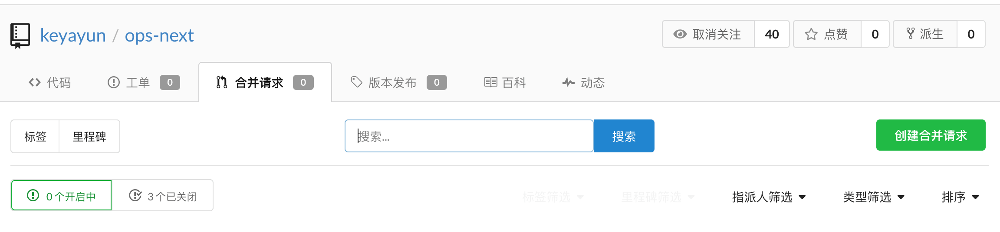
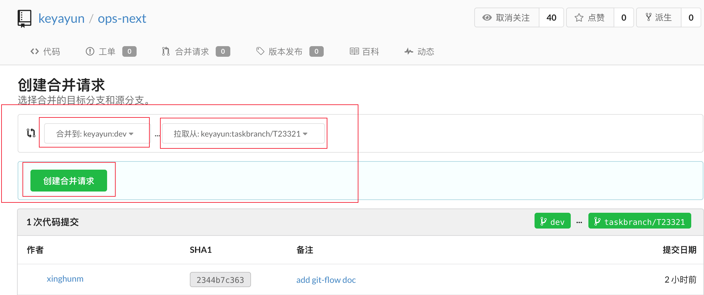
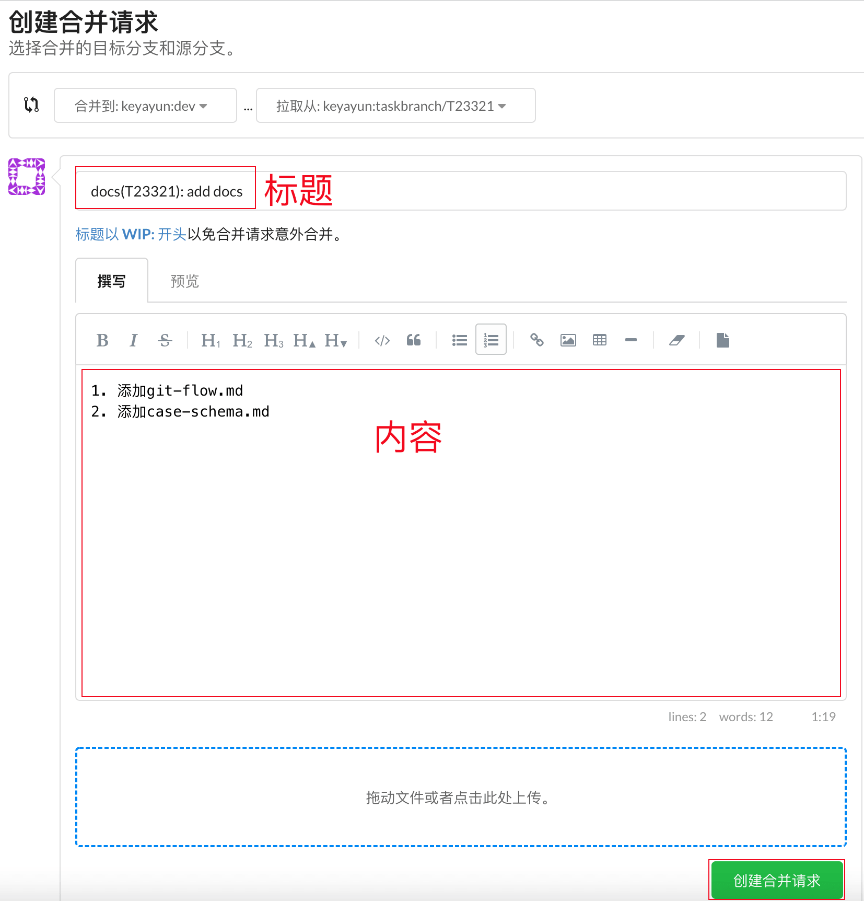
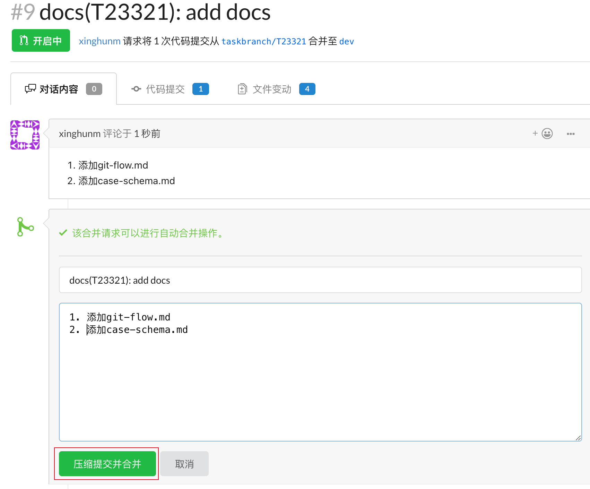

### git 分支模型

#### master 分支

master 分支为最稳定的分支，随时都是一个预备生产状态，因此**不允许**(已通过 husky 禁止)直接向 master 分支 push 代码。理论上只能在 [hotfix 分支](#hotfix-分支)、 [release 分支](#release-分支)达到**稳定待发布**的状态后才能将其 merge 进 master，然后标记一个版本号。查看 master 的提交历史，应该看到的是一个个版本 tag。
向 master merge 的方式只能通过 [Pull Request](#pull-requset)。

#### dev 分支

与 master 分支并行的另一个分支，称为开发分支。我们的 task 分支基本都会合并到 dev 分支。同 master 一样，不能直接 push 代码到 dev 分支，需要通过 PR 的方式请求合并。

#### release 分支

当 dev 分支开发到一定程度后，需要进行发版测试，就从 dev 分支创建一个 release 分支并更新版本号。
这个 release 分支可能会存在一段时间，直到该发行版到达它的预定目标(测试通过)。在此期间，bug 的修复可能被提交到该分支上(而不是提交到 dev 分支上)。在这里严格禁止增加大的新 features，他们必须合并到 dev 分支上，然后等待下一次大的发行版。
当 release 分支准备好成为一个真正的发行版的时候，需要将其 merge 到 master 并打上 tag，同样需要 merge 到 dev 以同步在 release 上修复的 bug。

#### hotfix 分支

即热修复分支，当线上出现 bug 时，需要创建 hotfix 分支，hotfix 分支可以基于 master 分支上对应线上版本的 tag 创建，也可以基于对应的 release 分支创建，创建后更新版本，待 bug 修复后 merge 回 master(需打 tag)和 dev。

#### task 分支

对应在 phabricator 上创建的 task 分支，最终都应合并到 dev 分支上。

### [Pull Requset](https://liwt31.github.io/2019/09/01/nopush/)

步骤如下：

- 基于 dev 分支创建 task 分支

- 推送 task 分支到远程仓库

- 到[仓库管理界面](https://git.keyayun.com/keyayun/ops-next/pulls)点击创建合并请求
  无需 fork 仓库，直接在当前仓库提交即可。
  

- 选择要 PR 的分支并点击创建
  需要注意的是”合并到“是**选择 dev 分支**，”拉取从“选择当前要请求合并的 task 分支。
  
- 撰写 PR 标题和内容并点击创建合并请求

  PR 的标题和内容需要遵循一定的[格式](<(#pull-requsethttpsliwt31githubio20190901nopush)>)。
  

- 等待仓库 owner 通过 PR

  owner 选择压缩提交并合并，填写 commit 信息。
  

### PR 内容格式要求

#### 标题

格式如下：
需要注意的是 task 与 subject 间的**空格**是必须要有的。

```
<type><task>: <subject>
例：
docs(T23321): add docs
```

- type

  其中 type 为以下固定的几种类型，用于说明 commit 的类别。

  ```
  //type
  feat：新功能（feature）
  fix：修补 bug
  docs：文档（documentation）
  style： 格式（不影响代码运行的变动）
  refactor：重构（即不是新增功能，也不是修改 bug 的代码变动）
  test：增加测试
  chore：构建过程或辅助工具的变动

  ```

- subject

  subject 是 commit 目的的简短描述。

- task

  task 部分是本次提交对应的 task 号。

### 内容

内容部分是对本次 commit 的详细描述，分条叙述。

```
1. 添加git-flow.md
2. 添加case-schema.md
```
